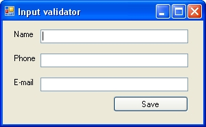

# CSharp_RegExp_Serialization_Threading_Week15A

<h2>Exercises in the subject of Regular Expressions, File Encoding, Serialization and Threading</h2>

In this week (Week15A) I got some exercises to solve in the above-mentioned topics. 
This repository contents six C# solutions. Three of them is about Threading.

<h4>The tasks were the next:</h4>

<ul>
  <li><b>Regular Expressions</b></li>
  <ul>
    <li><a href="#ex1">Exercise 1: Input validations</a></li>
	<li><a href="#ex2">Exercise 2: Reformat a string</a></li>
  </ul>
  <li><b>File Encoding</b></li>
  <ul>
    <li><a href="#ex3">Exercise 3: Convert a Text File to a Different Encoding Type</a></li>
  </ul>
  <li><b>Serialization</b></li>
  <ul>
    <li><a href="#ex4">Exercise 4: Make a Class Serializable</a></li>
	<li><a href="#ex5">Exercise 5: Serialize an Object</a></li>
	<li><a href="#ex6">Exercise 6: Deserialize an Object</a></li>
	<li><a href="#ex7">Exercise 7: Optimize a Class for Deserialization</a></li>
	<li><a href="#ex8">Exercise 8: Update a Class to Use Custom Serialization</a></li>
  </ul>
  <li><b>Threading</b></li>
  <ul>
    <li><a href="#ex9">Exercise 9: Create Multiple Threads (SimpleThreadingDemo)</a></li>
	<li><a href="#ex10">Exercise 10: Use a Mutex to Create a Single-Instance Application (SingleInstance)</a></li>
	<li><a href="#ex11">Exercise 11: Use the ThreadPool to Queue Work Items (ThreadPoolDemo)</a></li>
  </ul>	  
</ul>

<h3>Regular Expressions</h3>

<h4 id="ex1"><i>Input validations</i></h4>

The task includes a Windows Form application with 3 textbox to check a person's data with regular expressions if them are correct or not.

<h4 id="ex2"><i>Reformat a string</i></h4>

In this task, I had to reformat phone numbers from the previous exercise into a standard (###) ###-#### format using regular expressions.

<h3>File Encoding</h3>

<h4 id="ex3"><i>Convert a Text File to a Different Encoding Type</i></h4>

In this exercise, I had to convert a text file to UTF-7.

<h3>Serialization</h3>

<h4 id="ex4"><i>Make a Class Serializable</i></h4>

In this task, I had to make a class (called Person) serializable. 

<h4 id="ex5"><i>Serialize an Object</i></h4>

In this exercise, I had to use BinaryFormatter to serialize Person objects - made serializable in the previous exercise. 

<h4 id="ex6"><i>Deserialize an Object</i></h4>

This task was about reading an object from the disk that has been serialized previously by using BinaryFormatter.

<h4 id="ex7"><i>Optimize a Class for Deserialization</i></h4>

In this exercise, I had to add the 'NonSerialized' attribute to a class property, and I also had to implement the IDeserializationCallback interface.

<h4 id="ex8"><i>Update a Class to Use Custom Serialization</i></h4>

This task included to implement the ISerialize interface and use the GetObjectData method.

<h3>Threading</h3>

<h4 id="ex9"><i>Create Multiple Threads</i></h4>

In this exercise, I created a simple console application what can work with two threads simultaneously.

<h4 id="ex10"><i>Use a Mutex to Create a Single-Instance Application</i></h4>

In this task, I created a simple console application in which the program use a Mutex to ensure there is only one instance of the application running at any point.

<h4 id="ex11"><i>Use the ThreadPool to Queue Work Items</i></h4>

This exercise included the creation of an application that uses the ThreadPool to queue up methods to call on separate threads.

